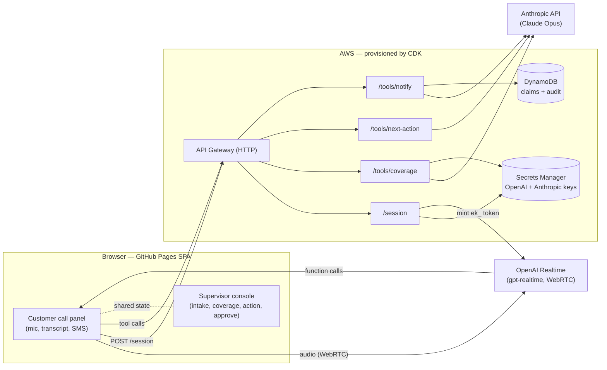
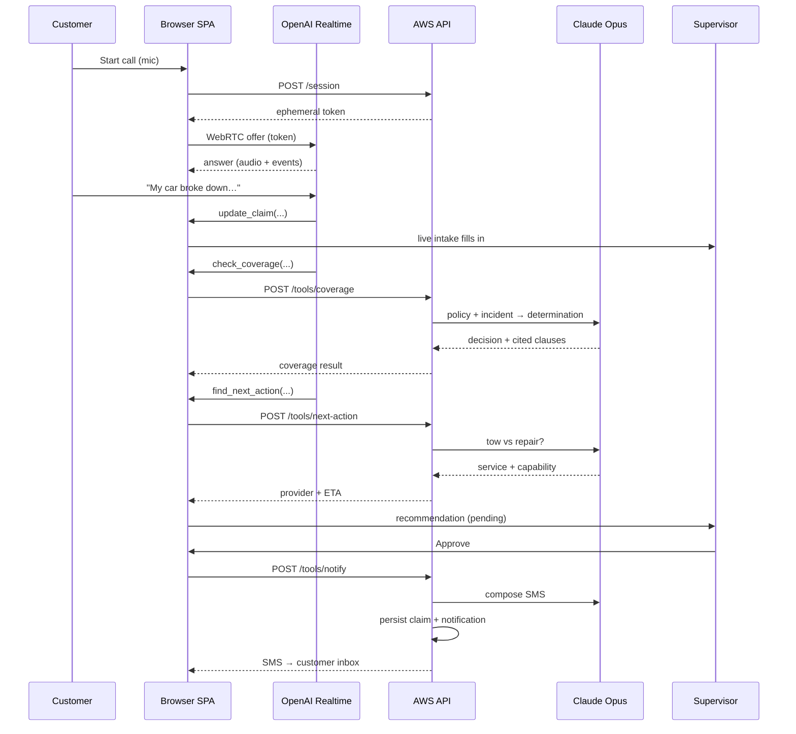

# Architecture

Roadside Co-Pilot is a static single-page app (GitHub Pages) talking to a thin serverless API on AWS
(provisioned with CDK). Voice runs directly between the browser and OpenAI Realtime; the AWS API mints
the session token and runs the reasoning tools on Claude Opus.

## Components

## Call flow

## Why this shape

- **Static UI + thin API.** GitHub Pages can't hold secrets, so all keys live in AWS Secrets Manager
  and the SPA only ever talks to our API (or, for audio, to OpenAI using a short-lived token). This
  also keeps the front end trivially cacheable and free to host.
- **OpenAI Realtime over WebRTC.** Best-in-class conversational voice with **low plumbing**: the heavy
  audio stream is browser↔OpenAI directly; AWS only mints an ephemeral `ek_` token, so the real key
  never reaches the client.
- **Claude Opus as the brain.** Coverage decisions must be auditable. Opus returns cited clauses +
  confidence via tool-forced structured output, and the policy document is sent as a
  prompt-cached block. *Voice and brain are decoupled and independently swappable.*
- **Per-route Lambdas behind one HTTP API.** Each tool is an isolated function; `addRoute()` wires a
  new one in a line. DynamoDB stores the claim snapshot + an append-only audit/notification trail.

## Quality & evals (planned fast-follow)

Out of scope for the day-one prototype, but the immediate next step. The plan is to score the reasoning
endpoints against a golden dataset on a four-dimension rubric — **guided outcome** (correct decision),
**tool call** (valid structured output + correct service/capability/provider), **hallucination** (every
cited clause quote verbatim in the source policy), and **relevance** (LLM-as-judge) — with the
deterministic dimensions forming a **CI regression gate** against the live API (keys stay server-side,
so CI needs no secrets). This makes coverage accuracy and citation-faithfulness measurable and
regression-proof, which is essential for an auditable insurance decision. A working spike lives on the
`spike/evals` branch.

## Production note

The prototype calls the Anthropic API directly for velocity. For an enterprise insurer, production
would likely run Opus on **Amazon Bedrock** for in-account data residency, IAM auth, and governance —
the same model behind a different transport, isolated to the `shared/anthropic` module.

See [PRD.md](./PRD.md) for product scope, milestones, and risks.
